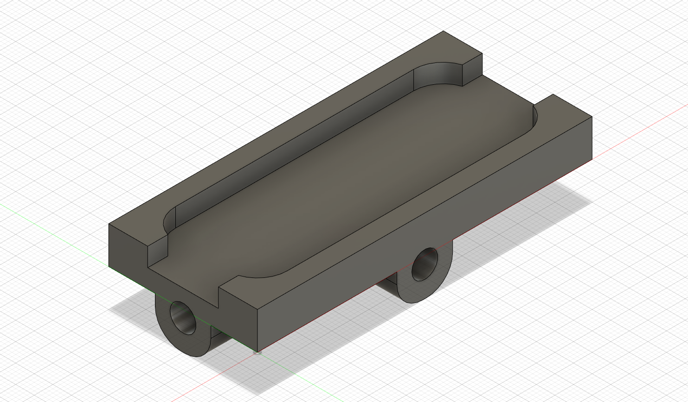

# Tripod mount for Leap Motion Controller
 
This is a simple tripot mount for Leap Motion Controller.

You need 2 insert. Insert specification : Diam 0.8mm, Lenght 23mm, 1/4" threads (photo standard)

I recommend printing the cross section on the bed, so the face receiving the leap motion stay clean.

